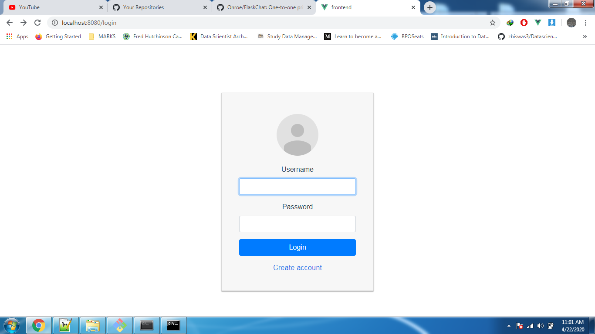
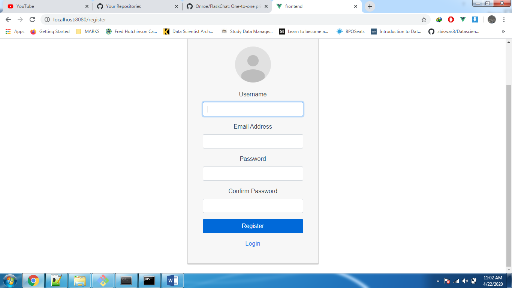

# FlaskChat
One-to-one private chat using Vue.js, Flask and SocketIO


###  Prerequisites
- [Python 3.6+](https://www.python.org/)
- [Node.js](https://nodejs.org/) version 8.9 or above
- [Vue cli](https://cli.vuejs.org/guide/installation.html)
- [socketio](https://socket.io/)
- [PostgreSQL](https://www.postgresql.org/)


### Setting up the project to run on a local machine
First, clone this repository to your local machine:

```sh
$ git clone https://github.com/Onroe/FlaskChat.git
```

### Running the App

##Extract the files 

- Using your python terminal, navigate into the - api folder to install dependencies:

```
$ pip install -r requirements.txt
```
- Create database tables from database.py

```
$python
$from database import init_db
$init_db()
```
- Run the api:
```
$ flask run
```

####Run the frontend
-Open a new nodejs terminal window, then navigate to the frontend folder:

Install dependencies:
```
$npm install

```

Then run the app:

```
$ npm run serve
```
-Check the URL  - http://localhost:8080/login. to create an account and start chatting






